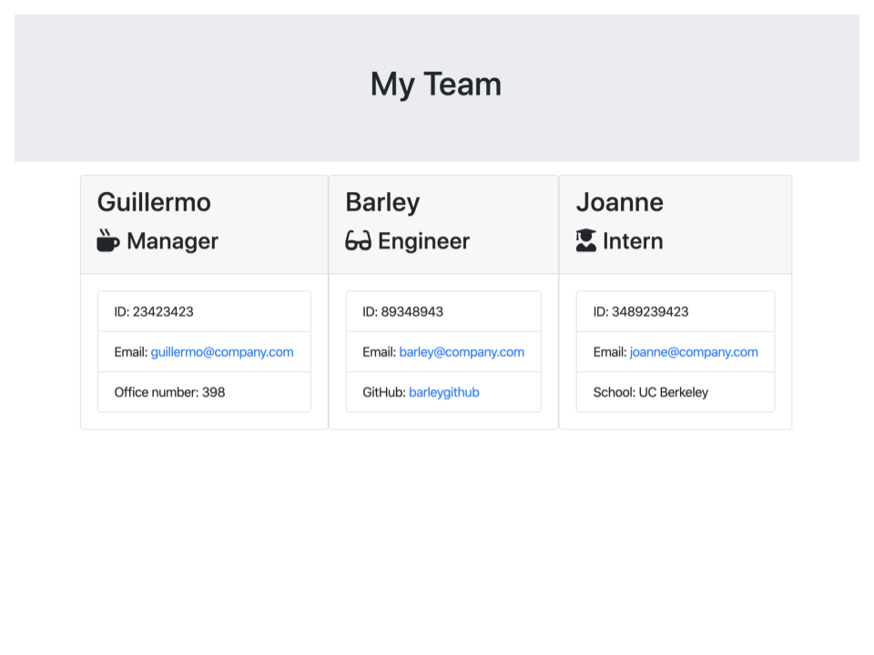

# Team Profile Generator

## Description
The following application is a command-line application that will create an HTML file with employee information gathered from a series of prompts.  In order to use
the application, a user would navigate to the "Develop" folder where "app.js" is located. The application can then be started by typing the following command in the
terminal and pressing the "enter" key:

```sh
node app.js
```

The user will then be prompted with a series of basic questions regarding an employee.  Depending on the role of an employee, a question specific to that role will
be asked.  After answering all the questions regarding an employee, the user has an option to create another employee.  Once a user has created their desired
number of employees, an HTML file will be generated that displays each employee as a Bootstrap card.


## Technologies
This application uses the following: Node.js, Inquirer, and Jest.

## Experiences
Building this application was a good experience that helped reinforced concepts I had learned previously.  One of the challenging parts I had building this 
application was connecting all of the files so that the main application would work.  I learned more about utilizing tests in an application and using tests
in test driven development.  


## Screenshot


